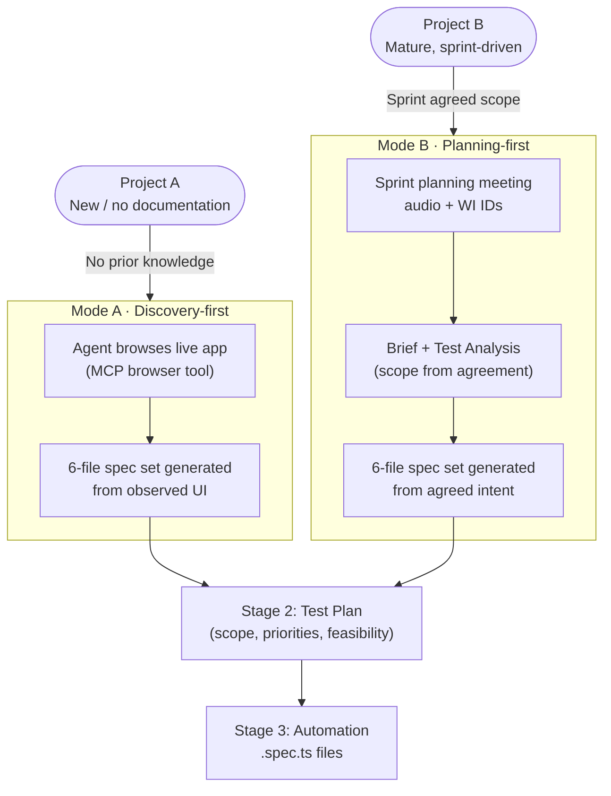
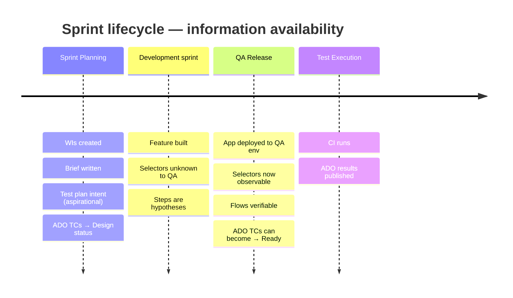
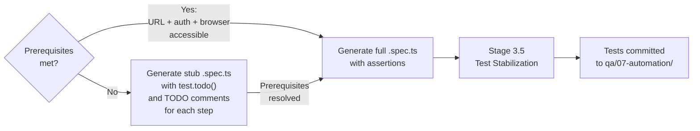

# Framework Iteration 01 — Process Analysis & Design Findings

**Document type**: Meta-analysis / Framework retrospective
**Date**: 2026-03-05
**Framework version reviewed**: 1.0.0
**Status**: Draft — for use as input to framework iteration 2

---

## Summary

### What was discussed

After the initial construction of `keber/qa-framework` v1.0.0, a structured design
discussion was held examining the framework's pipeline model, its assumptions, and how it holds
up against two real operational contexts: projects starting from scratch and mature projects
receiving new sprint-driven features.

### Key findings at a glance

1. The framework models **one input stream** (UI discovery) but the real world has **two**:
   one empirical (observed UI) and one normative (sprint-agreed scope). These are different
   processes with different inputs, different epistemic statuses, and different failure modes.

2. There is a **hard temporal gap** between sprint planning and QA release that the framework
   ignores. Test plans written at planning time have fundamentally different reliability than
   ones written after QA release. Treating them as the same artifact creates false confidence
   in ADO.

3. The "exhaustive test revision" recovery loop is the **most operationally validated piece**
   of the whole system, yet it lives in a `references/` folder rather than as a first-class
   framework stage. This is the clearest gap between documented process and actual practice.

4. Stage 3 (Automation) implicitly requires live app access but doesn't declare it as a
   prerequisite. The MCP agent generates specs from documentation, producing tests that fail
   at runtime due to selector hallucination, flow assumption failures, and timing issues.

5. Intermediate artifacts are **load-bearing for agents** even when redundant for humans, but
   only when each artifact adds a genuine transformation — not a restatement. Some current
   artifacts (test-plan.md vs 05-test-scenarios.md) are close to restatements.

### Current state — pros and cons

| Pros | Cons |
|------|------|
| Complete pipeline defined end-to-end | Single entry mode only (UI discovery) |
| Intermediate artifacts protect against token truncation | No temporal model (planning vs release) |
| Agent instructions cover all main stages | Stage 3.5 (stabilization) is missing entirely |
| ADO integration is fully parameterized | Two artifacts overlap in content (test plan vs scenarios) |
| `06-maintenance.md` handles post-release changes | Maintenance burden grows non-linearly with module count |
| `session-summary.md` enables cross-session continuity | No pipeline state tracker across stages |
| Exhaustive revision prompt exists and is tested | Not promoted to first-class agent instruction |

### Next steps (headline)

1. Define two explicit entry modes (Mode A: Discovery-first, Mode B: Planning-first)
2. Split `test-plan.md` into intent and concrete versions
3. Promote `PROMPT_Exhaustive_test_revision` to `agent-instructions/04b-test-stabilization.md`
4. Add pipeline state tracking concept to `session-summary.md`
5. Add Stage 3 prerequisites declaration to `04-automation-generation.md`
6. Create `agent-instructions/00-sprint-intake.md` for Mode B entry

---

## Detailed Analysis

### 1. The Pipeline Model Is Correct — The Input Model Is Not

The framework correctly identifies the pipeline as a transformation chain from application to
ADO test run. The stage outputs are well-defined and the intermediate artifact chain is sound.

The error is in assuming a **single starting point**: live UI access. In practice there are two
distinct contexts in which a QA process starts:



Both modes must converge at the same artifact: a 6-file spec set per submodule. After that,
the pipeline is identical. This is the cleanest architectural boundary and the right place to
design the two modes to join.

**Key distinction**: Mode A's spec set is *observed fact*. Mode B's spec set is *agreed intent*.
Both are valid starting points but have different confidence levels and different update triggers.

---

### 2. The Temporal Gap Is a Structural Problem

Mode B (planning-driven) has a built-in temporal problem that the framework currently ignores:



**The problem**: A test plan written at planning time contains inferred steps, not observed ones.
If ADO Test Cases are created from this plan and marked `Ready`, the status is wrong. The CI
will fail not because the feature is broken but because the steps described never matched reality.

**Current framework treatment**: `test-plan.md` is a single artifact with no versioning by
lifecycle phase. `create-testplan-from-mapping.ps1` creates ADO WIs from this plan immediately,
implying `Ready` status.

**Required change**: Two versioned variants of the test plan artifact, with ADO WI status as
the formal marker of the transition between them.

| Document | Written when | ADO TC status | Content |
|----------|-------------|---------------|---------|
| `test-plan-intent.md` | Sprint planning | `Design` | General steps, WI scope, acceptance criteria from agreement |
| `test-plan-concrete.md` | After QA release | `Ready` | Actual selectors, observable steps, real data shapes |

The `Ready` status in ADO becomes a meaningful quality gate, not a formality.

---

### 3. The Missing Stage: Test Stabilization

The actual operational flow currently practiced is:

```
Agent generates .spec.ts files
         ↓
A significant fraction don't run (selector issues, flow failures, timing, auth)
         ↓
Manual triage + PROMPT_Exhaustive_test_revision applied
         ↓
Iterative fix loop until ≥90% pass
         ↓
Committed tests
```

This is **Stage 3.5 in disguise**. It exists, it has been validated, it has a prompt. It is
not in the framework documentation. The `PROMPT_Exhaustive_test_revision` prompt should become
`agent-instructions/04b-test-stabilization.md`.

#### Root causes of broken generated tests (observed pattern)

| Failure mode | Description | Mitigation |
|---|---|---|
| Selector hallucination | Agent invents selector from spec description; real DOM differs | Stage 3 must require live app access; agent must inspect DOM directly |
| Flow assumption failure | Agent assumes linear navigation; app has guards, redirects, modal sequences | Agent must trace actual navigation before writing assertions |
| Auth state leakage | Tests pass in isolation, fail with shared `storageState` | Explicit auth state reset between test blocks |
| Timing assumptions | `click()` without `waitFor*()` or `expect().toBeVisible()` gates | Require explicit wait before every assertion |
| Coverage over executability | Agent optimizes for breadth; generates N tests, M run | Optimize for minimum runnable set first; coverage grows later |

#### The generation quality heuristic

A long list of non-running tests is **strictly worse** than a short list of running ones:
- False metrics in ADO (N test cases, M% execute)
- Immediate maintenance debt
- Erodes team trust in the automation layer

**Recommended generation constraint for Stage 3**: Generate the minimum set of tests that cover
P0 and P1 scenarios and are each independently runnable. Do not generate P2/P3 until the P0/P1
set passes stabilization.

---

### 4. Live App Access Is a Stage 3 Prerequisite, Not an Assumption

`04-automation-generation.md` currently assumes spec files are sufficient input. They are not.

The agent needs:
- QA environment URL reachable
- Auth credentials in `.env` valid and tested
- MCP browser tool available and authenticated
- At minimum, one successful manual navigation of each flow to be automated

If any of these are absent, the agent should produce **spec stubs** with `test.todo()` markers
and stop — not generate full tests that will fail at runtime and require a separate recovery loop.



---

### 5. Intermediate Artifacts — When Redundancy Is Justified

The discussion established a useful distinction:

**Justified redundancy** (each file extracts a different abstraction from the same observations):
```
00-inventory.md     → what exists (elements, endpoints)
01-business-rules.md → why it works that way (constraints, logic)
02-workflows.md     → how users move through it (sequences)
03-roles-permissions.md → who can do what
04-test-data.md     → what data is needed to test it
05-test-scenarios.md → what should be tested
```

**Questionable redundancy** (restatement with metadata reordering):
```
05-test-scenarios.md → lists TCs with priority
test-plan.md        → reorganizes same TCs with risk/feasibility added
```

For agent-driven workflows, all intermediate outputs serve as **resumption points** that protect
against token-truncation information loss. This makes them valuable at the current state of
agent tooling. However, the maintenance cost multiplies with module count.

**Recommended principle**: Distinguish **ground truth** artifacts from **derived** artifacts.
Ground truth (inventory + scenarios) requires human review on every app change. Derived artifacts
(test plan, execution report) should be **regenerable on demand** rather than manually maintained.

---

### 6. Pipeline State Is Missing as a Concept

Currently, to determine where a module stands in the pipeline, an agent or human must read
multiple files and infer the state. There is no single authoritative signal.

This creates a continuity problem across sessions — `session-summary.md` captures what happened
in one session, but not the stage-level status of the module globally.

A lightweight **module status tracker** would solve this. It could be as simple as a table in
a `qa/00-standards/pipeline-status.md` file, or a structured field at the top of the
`session-summary.md` template.

Example structure:

```markdown
## Pipeline status — [Module > Submodule]

| Stage | Status | Last updated | Artifact |
|-------|--------|-------------|---------|
| 0 Bootstrap | ✅ Done | 2026-01-10 | qa-framework.config.json |
| 1 Discovery | ✅ Done | 2026-02-15 | suppliers/00-inventory.md |
| 2 Planning (intent) | ✅ Done | 2026-02-20 | 05-test-plans/suppliers-intent.md |
| 2 Planning (concrete) | ⏳ Pending QA release | — | — |
| 3 Automation | ⏳ Blocked by Stage 2 concrete | — | — |
| 3.5 Stabilization | ⏳ Not started | — | — |
| 4 ADO Wiring | ⏳ Not started | — | — |
| 5 Execution | ⏳ Not started | — | — |
| 6 Review | ⏳ Not started | — | — |
```

---

## Next Steps for Framework Iteration 2

> These steps are written in instructive form and can be executed by an agent
> working on the framework repository at `c:\Users\keber.flores\source\repos\qa-framework\`.

---

### Step 1 — Define two entry modes in the framework root documentation

**Target files**: `README.md`, `docs/architecture.md`

Add a `## Entry Modes` section that explicitly defines:
- **Mode A (Discovery-first)**: starts from live app access, produces spec set from observed UI
- **Mode B (Planning-first)**: starts from sprint WIs + meeting brief, produces spec set from agreed intent

Both modes converge at the 6-file spec set. State this convergence point explicitly. Update the
pipeline diagram in `docs/architecture.md` to show two entry arrows.

---

### Step 2 — Create `agent-instructions/00-sprint-intake.md`

This is the Mode B equivalent of `00-module-analysis.md`. It must define:
- **Input**: sprint WI IDs, meeting brief or transcription summary, ADO plan ID
- **Process**: extract scope, map WIs to submodules, infer general test steps from acceptance criteria
- **Output**: populated 6-file spec set (with `test-plan-intent.md` instead of full concrete spec)
- **Explicit limitation**: selectors and exact steps are placeholders until QA release — replace
  with `TODO: verify after QA release` comments in any selector-level content
- **ADO action**: create Test Cases with status `Design`, NOT `Ready`

---

### Step 3 — Split `templates/test-plan.md` into two variants

Create:
- `templates/test-plan-intent.md` — planning-time version; general steps; acceptance criteria focus
- `templates/test-plan-concrete.md` — post-release version; exact selectors; observable steps; data shapes

Add a header field to each:
```markdown
**Lifecycle phase**: Planning-intent / QA-release-concrete
**ADO TC status**: Design / Ready
```

Update `agent-instructions/02-test-plan-generation.md` to:
1. Ask which phase is active before generating
2. Generate the correct variant
3. Instruct to update `pipeline-status.md` after generation

---

### Step 4 — Create `agent-instructions/04b-test-stabilization.md`

Promote the content of `references/PROMPT_Exhaustive_test_revision` into a formal agent
instruction file. The file must define:

- **Input**: generated `.spec.ts` files from Stage 3, running QA environment
- **Entry criterion**: at least one test run attempted (results available)
- **Process**:
  1. Run full suite; capture output
  2. Classify each failure by root cause (selector / flow / timing / auth / data)
  3. Fix in priority order: auth → flow → selector → timing → data
  4. Re-run after each fix class; do not fix all at once
  5. Iterate until pass rate ≥90% or all remaining failures are documented with `test.skip()` + DEF reference
- **Exit criterion**: ≥90% pass rate; every skip has a DEF reference; no silent failures
- **Output**: stabilized `.spec.ts` files; updated `COVERAGE-MAPPING.md`; session summary
- **Constraint**: never modify application source code; scope is limited to test files only

---

### Step 5 — Add prerequisite check to `agent-instructions/04-automation-generation.md`

At the top of the file, before any generation instructions, add a **Prerequisites Gate** section:

```markdown
## Prerequisites Gate (must verify before generating tests)

Check all of the following before generating any `.spec.ts` content:

- [ ] `QA_BASE_URL` is set in `.env` and the URL responds (HTTP 200)
- [ ] `QA_USER_EMAIL` and `QA_USER_PASSWORD` are set and produce a successful login
- [ ] MCP browser tool is available and can navigate to `QA_BASE_URL`
- [ ] At least one target flow has been manually traced in the browser

If ANY prerequisite is unmet:
- Generate stub `.spec.ts` files with `test.todo('TODO: verify after QA release — [step description]')`
- Add a `## Blocked` section to `session-summary.md` listing what is missing
- Do NOT generate full assertion-level tests
```

---

### Step 6 — Add pipeline state tracker to `templates/session-summary.md`

Add a `## Pipeline Status` table to the session summary template (see example in section 6 of
this document). The table must be updated at the end of every session by the agent. This makes
resumption unambiguous — any agent starting a new session reads this table and knows exactly
which stage to enter.

---

### Step 7 — Clarify ground truth vs derived artifacts in `docs/spec-driven-philosophy.md`

Add a section `## Artifact Types: Ground Truth vs Derived` that defines:

- **Ground truth**: `00-inventory.md`, `05-test-scenarios.md` — must be manually reviewed on
  every app change; these are the source of correctness for all downstream artifacts
- **Derived**: `test-plan.md`, `execution-report.md`, `COVERAGE-MAPPING.md` — regenerable on
  demand; should not be manually maintained between sprints; flag when stale

Add a **staleness rule**: if the app has been updated and `00-inventory.md` has not been
refreshed, all derived artifacts are considered stale and must be regenerated before the next
execution cycle.

---

### Step 8 — Add generation quality constraint to `agent-instructions/04-automation-generation.md`

After the prerequisites gate, add a **Generation Strategy** section:

```markdown
## Generation Strategy

Generate tests in priority order. Do not proceed to the next tier until the current tier
passes stabilization (Stage 3.5).

Tier 1 (generate first): All P0 test cases from `05-test-scenarios.md`
Tier 2 (generate after Tier 1 stable): All P1 test cases
Tier 3 (optional): P2 and P3 cases with explicit justification

A suite with 5 stable passing P0 tests is strictly better than a suite with 20 tests
where 12 are failing or skipped. Optimize for executability, not coverage count.
```

---

*This document is a living meta-analysis. It should be updated after each framework iteration
with new findings from operational use.*
