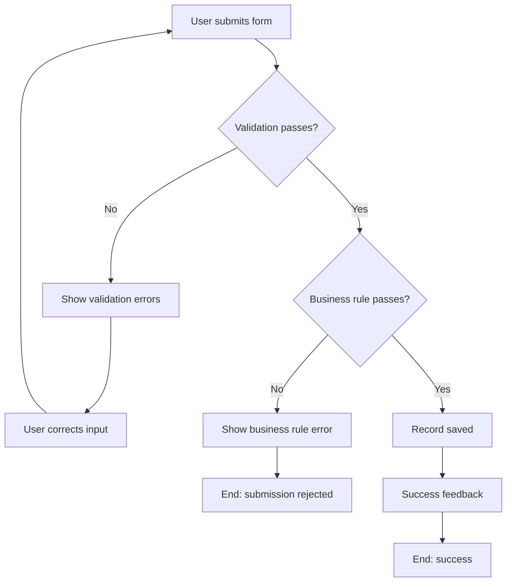

# Workflows — {{MODULE_NAME}}: {{SUBMODULE_NAME}}

> **Module code**: {{MODULE_CODE}} | **Submodule code**: {{SUBMODULE_CODE}}  
> **Last updated**: YYYY-MM-DD

---

## FL-{{MODULE_CODE}}-001: {{Main Workflow Title}}

**Actor**: {{Role}}  
**Trigger**: {{What starts this workflow}}  
**Precondition**: {{What must be true before this starts}}

```
[Start: navigate to {{URL}}]
        │
        ▼
[Click 'New' button]
        │
        ▼
[Form opens]
        │
        ├─[Required field empty]──► [Validation error shown] ──► [User corrects] ──► (loop back)
        │
        ▼
[Fill all required fields]
        │
        ▼
[Click 'Save']
        │
        ├─[Duplicate detected]────► [System shows duplicate error] ──► [End: failure]
        │
        ▼
[Success message displayed]
        │
        ▼
[New record appears in list]
        │
        ▼
[End: record created successfully]
```

**Postcondition**: New record is persisted. Visible in the list view.

---

## FL-{{MODULE_CODE}}-002: {{Rejection / Cancellation Workflow Title}}

**Actor**: {{Role}}  
**Trigger**: {{What starts this workflow}}  
**Precondition**: {{What must be true before this starts}}

```
[Start: navigate to pending records list]
        │
        ▼
[Select record]
        │
        ▼
[Click 'Reject' / 'Cancel']
        │
        ▼
[Confirmation dialog appears]
        │
        ├─[User clicks 'No' / 'Cancel']──► [Dialog closes, no change]
        │
        ▼
[User confirms]
        │
        ▼
[System validates preconditions]
        │
        ├─[Precondition not met]─────────► [Error message]──► [End: rejected]
        │
        ▼
[Record status changes to 'Rejected']
        │
        ▼
[Notification sent (if applicable)]
        │
        ▼
[End: record rejected]
```

**Postcondition**: Record status = Rejected. Notification sent to relevant parties.

---

## FL-{{MODULE_CODE}}-003: {{Error/Validation Workflow Title}}

**Actor**: {{Role}}  
**Trigger**: {{What starts this workflow when things go wrong}}



---

## Changelog

| Version | Date | Description |
|---------|------|-------------|
| 1.0 | YYYY-MM-DD | Initial creation |
